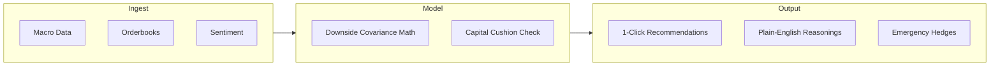

# Araiven Decision Engine - Architecture Specification V1.0

This document defines the underlying logic, data pipelines, scoring models, and agent architectures of Araiven—the intelligence engine driving Ravora.

---

## 1. What is Araiven?
**Araiven** is the multi-dimensional decision and risk engine that powers Ravora. It operates as a non-custodial, analytical brain. 

Unlike simple chat bots, Araiven continuously maps macro environments, news flows, orderbook dynamics, and wallet parameters onto a unified mathematical model to output risk thresholds, opportunity confluences, and plain-English recommendations.

---

## 2. System Input Ingestion (The Scanned Universe)
Araiven monitors and correlates four primary categories of real-time data:

```
+-------------------------------------------------------------------------------+
|                                INGESTION ENGINE                               |
+--------------------------------------+----------------------------------------+
                                       |
    +----------------------------------+----------------------------------+
    |                                                                     |
+---v------------------------+                                      +----v-----------------------+
|    MARKET & LIQUIDITY      |                                      |    GLOBAL CONTEXT          |
+----------------------------+                                      +----------------------------+
| * Orderbook Depth          |                                      | * Macro Announcements (Fed)|
| * Liquidity Pool Spreads   |                                      | * CPI / Interest Rates     |
| * Volume Profile (VPVR)    |                                      | * Real-time News Feeds     |
| * Token Volatility Indices |                                      | * Social Sentiment Trends  |
+----------------------------+                                      +----------------------------+
    |                                                                     |
    +----------------------------------+----------------------------------+
                                       |
+--------------------------------------v----------------------------------------+
|                            USER EXPOSURE CONTEXT                              |
+-------------------------------------------------------------------------------+
| * Current Stance Stated (Conservative, Balanced, Aggressive)                 |
| * Actual Wallet Holdings & Entry Bases                                        |
| * Max Drawdown Cap Constraints (1.5%, 3.5%, 8.5%)                             |
| * Financial Goal Stance (Preservation, Income, Growth)                        |
+-------------------------------------------------------------------------------+
```

---

## 3. The Processing Pipeline

Araiven processes data in three sequential stages:



### Stage 1: Ingest & Correlate
* **Volatility Aggregation:** Feeds are ingested at a frequency of 24k+ data points/sec.
* **Sentiment Indexing:** Natural Language Processing (NLP) models scan news headlines and feeds to generate a daily sentiment momentum score between `-1.0` (panic) and `+1.0` (euphoria).

### Stage 2: Stance Filtering & Simulation
* **Covariance Calculation:** Maps the correlation between active tokens (BTC, ETH, SOL) and stablecoin yield indexes.
* **Safety Cushion Check:** Calculates the probability of the portfolio violating the user's active drawdown cap.
* **Arbitrage Matching:** Evaluates decentralized lending pools (e.g., Aave, Uniswap) to find yield spreads that exceed the current portfolio baseline yield.

### Stage 3: Output Generation
* Outputs recommendations only when confidence checks pass.
* Formulates explanations tailored to the user's experience profile.
* Triggers automatic rotation to stablecoins if drawdown caps are violated.

---

## 4. Scoring Methodologies

### 4.1 Confidence Scoring
The **Araiven Confidence Score ($C_s$)** is a percentage value representing the statistical probability of the opportunity meeting its expected return zone without breaching drawdown boundaries.

$$C_s = (W_m \cdot M_c) + (W_l \cdot L_d) + (W_s \cdot S_i)$$

Where:
* $M_c$ = Macro Confluence Index (0 to 1): Alignment with Fed rates and DXY trends.
* $L_d$ = Liquidity Depth Score (0 to 1): Orderbook support at entry levels.
* $S_i$ = Sentiment Inflow Indicator (0 to 1): Sentiment momentum.
* $W_m, W_l, W_s$ = Weighting parameters dynamically adjusted by volatility (default: $0.4$, $0.4$, $0.2$).

*If $C_s < 75\%$, the opportunity is filtered out and never surfaced to the user.*

### 4.2 Portfolio Safety Score
The **Safety Score** is a metric from 0 to 100 indicating the current health of the portfolio relative to market stress:
* **90 - 100 (Safe):** Portfolio assets have high liquidity, low correlation, and a wide buffer below the drawdown cap.
* **70 - 89 (Caution):** Minor volatility detected, or asset correlation is increasing.
* **Below 70 (Risk):** Drawdown buffer is nearly depleted. Araiven prepares emergency stablecoin hedging protocols.

---

## 5. Evolution: Multi-Agent AI Architecture
To scale to millions of users, Araiven is designed to transition from a single monolithic pipeline into a **Multi-Agent Orchestrated System**:

```
                  +--------------------------------+
                  |         ORCHESTRATOR           |
                  |     (Araiven Coordinator)      |
                  +---------------+----------------+
                                  |
         +------------------------+------------------------+
         |                        |                        |
+--------v-------+       +--------v-------+       +--------v-------+
|  MACRO AGENT   |       |   RISK AGENT   |       | OPPORTUNITY    |
|                |       |                |       |    AGENT       |
| Monitors news, |       | Calculates     |       |                |
| CPI, Fed rates |       | wallet drawdown|       | Audits DEX     |
| and global     |       | covariance     |       | yields & L1    |
| sentiment      |       | boundaries     |       | momentum flows |
+----------------+       +----------------+       +----------------+
```

1. **Araiven Coordinator (Orchestrator):** Manages sub-agents, resolves conflicting directives, and compiles the final recommendations.
2. **Macro & Sentiment Agent:** Evaluates news feeds, social metrics, and macroeconomic events.
3. **Risk & Safety Agent:** Monitors user drawdown limits and manages automated hedging orders.
4. **Opportunity Discovery Agent:** Audits yields and maps support zones to identify entry targets.
