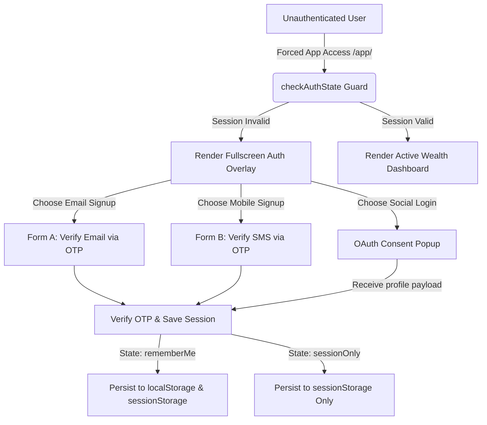

# Ravora Authentication System Engineering Guide

This document serves as the primary technical specification and maintenance manual for Ravora's authentication system, including database schemas, multi-channel OTP delivery, session state guards, and OAuth integration flows.

---

## 1. Authentication Architecture

Ravora uses a unified **Single Page Application (SPA) AuthManager** architecture built on top of Express (REST API backend) and client-side storage states.



### Client-Side SPA AuthManager (`dashboard.js`)
- **Route Guard:** `checkAuthState()` intercepts all dashboard routes (`/app/*`). If no valid token exists, or if a browser session is inactive, it suspends the application workspace and displays the fullscreen overlay `#auth-container`.
- **Remember Me Logic:** 
  - If **Remember Me** is checked, session keys are stored in `localStorage` with a 7-day expiration.
  - If **Remember Me** is unchecked, session parameters are stored in `sessionStorage`. Closing the tab/browser immediately logs the user out.
- **Single Source of Truth:** Duplicate authentication controllers, listeners, and templates have been stripped from the landing page. All authentication overlays are handled exclusively inside the `/app/` route.

---

## 2. Database Schema

Ravora utilizes an SQLite schema designed to migrate seamlessly to Supabase (PostgreSQL).

### Table: `users`
Tracks primary identities, cryptographic hashes, and verification flags.
```sql
CREATE TABLE users (
  id TEXT PRIMARY KEY,
  email TEXT UNIQUE,
  mobile_number TEXT UNIQUE,
  full_name TEXT,
  password_hash TEXT,
  is_mfa_enabled INTEGER DEFAULT 0,
  verified_email INTEGER DEFAULT 0,
  verified_mobile INTEGER DEFAULT 0,
  always_require_otp INTEGER DEFAULT 0,
  created_at TEXT DEFAULT CURRENT_TIMESTAMP,
  updated_at TEXT DEFAULT CURRENT_TIMESTAMP
);
```

### Table: `user_otps`
Stores hashed verification codes, attempts limits, and channels.
```sql
CREATE TABLE user_otps (
  id TEXT PRIMARY KEY,
  user_id TEXT,
  otp_code TEXT NOT NULL,       -- SHA-256 Hex Hash of 6-digit OTP
  channel TEXT NOT NULL,        -- 'email' or 'sms'
  attempts INTEGER DEFAULT 0,    -- Max 5 attempts
  expires_at TEXT NOT NULL,      -- 5 Minutes Expiry
  created_at TEXT DEFAULT CURRENT_TIMESTAMP,
  FOREIGN KEY (user_id) REFERENCES users(id) ON DELETE CASCADE
);
```

### Table: `user_devices`
Monitors logins from unrecognized browser agents to trigger Smart Security checks.
```sql
CREATE TABLE user_devices (
  id TEXT PRIMARY KEY,
  user_id TEXT NOT NULL,
  device_fingerprint TEXT NOT NULL,
  is_trusted INTEGER DEFAULT 0,
  ip_address TEXT,
  user_agent TEXT,
  last_login_at TEXT DEFAULT CURRENT_TIMESTAMP,
  FOREIGN KEY (user_id) REFERENCES users(id) ON DELETE CASCADE
);
```

---

## 3. Future Supabase Database Settings

To scale to production with **Supabase Auth**, configure the following properties:

1. **Authentication Settings:**
   - Go to **Authentication > Providers** and enable **Email** and **Phone** signups.
   - Set **Secure Password Strength** to `Min 8 characters, requiring digits/symbols`.
   - Disable **Confirm Email** if you want to use custom custom-coded OTP forms, or keep it enabled to trigger Supabase's built-in confirmation.
2. **Schema Mapping Triggers:**
   - Configure a database trigger to copy newly registered GoTrue auth profiles into your public profiles table:
     ```sql
     CREATE OR REPLACE FUNCTION public.handle_new_user()
     RETURNS trigger AS $$
     BEGIN
       INSERT INTO public.users (id, email, full_name)
       VALUES (new.id, new.email, new.raw_user_meta_data->>'full_name');
       RETURN new;
     END;
     $$ LANGUAGE plpgsql SECURITY DEFINER;
     
     CREATE TRIGGER on_auth_user_created
       AFTER INSERT ON auth.users
       FOR EACH ROW EXECUTE FUNCTION public.handle_new_user();
     ```

---

## 4. OAuth Setup Steps

Ravora handles OAuth authentication in a sandboxed mode using popups (`oauth-consent.html`). Follow these steps to map them to production developer credentials:

### A. Google OAuth Configuration
1. Go to the [Google Cloud Console](https://console.cloud.google.com/).
2. Create a project and navigate to **APIs & Services > Credentials**.
3. Configure the **OAuth Consent Screen** (specify User Type, logo, and scopes like `openid`, `email`, `profile`).
4. Click **Create Credentials > OAuth Client ID** (select *Web Application*).
5. Add Authorized Redirect URIs:
   - Development: `http://localhost:3000/v1/auth/google/callback`
   - Production: `https://yourdomain.com/v1/auth/google/callback`
6. Copy the Client ID and Client Secret into your `.env` configuration.

### B. GitHub OAuth Configuration
1. Log into GitHub and go to **Settings > Developer Settings > OAuth Apps**.
2. Click **New OAuth App**.
3. Enter your Application Name, Homepage URL, and Authorized Callback URL:
   - Development: `http://localhost:3000/v1/auth/github/callback`
   - Production: `https://yourdomain.com/v1/auth/github/callback`
4. Register the application, generate a **Client Secret**, and record your Client ID.

### C. Apple Sign In Configuration
1. Log into your [Apple Developer Account](https://developer.apple.com/).
2. Navigate to **Certificates, Identifiers & Profiles > Identifiers**.
3. Create an **App ID** and enable **Sign In with Apple**.
4. Navigate to **Keys** and create an Apple Sign In key to download the `.p8` private key file.
5. Create a **Service ID**, configure the redirection callback URLs, and link it to your App ID.

---

## 5. Required Environment Variables

Create a `.env` file in the root workspace directory containing the following values:

```ini
# Server Setup
PORT=3000
JWT_SECRET=your_jwt_signing_token_secret_key

# Email Dispatcher Settings
EMAIL_PROVIDER=resend             # options: 'resend', 'sendgrid', or 'console'
EMAIL_FROM=no-reply@yourdomain.com
SENDGRID_API_KEY=SG.xxx           # required if EMAIL_PROVIDER=sendgrid
RESEND_API_KEY=re_xxx             # required if EMAIL_PROVIDER=resend

# SMS & WhatsApp Settings (Twilio)
SMS_PROVIDER=twilio               # options: 'twilio' or 'console'
TWILIO_ACCOUNT_SID=ACxxx
TWILIO_AUTH_TOKEN=xxx
TWILIO_FROM_NUMBER=+15550000000

# WhatsApp Duplicate Delivery Settings
WHATSAPP_ENABLED=true             # options: 'true' or 'false'
TWILIO_WHATSAPP_FROM=whatsapp:+14155238886
```

---

## 6. Delivery Channels Configuration

### Email Provider Setup (SendGrid / Resend)
- **SendGrid API Method:** Dispatches HTTPS JSON payloads to `https://api.sendgrid.com/v3/mail/send`. Sender email addresses must be verified under **Sender Authentication** in the SendGrid Console.
- **Resend API Method:** Sends raw HTTP payloads to `https://api.resend.com/emails`. Supports simple webhook notifications. Make sure to verify your domain DNS records inside the Resend control panel.

### SMS & WhatsApp Provider Setup (Twilio)
- **Twilio REST Interface:** Makes basic auth encoded requests to `https://api.twilio.com/2010-04-01/Accounts/{SID}/Messages.json`.
- **WhatsApp Sandbox Testing:**
  1. Go to **Twilio Console > Messaging > Try It Out > Send a WhatsApp Message**.
  2. Join the sandbox by sending your sandbox code (e.g. `join code-name`) to Twilio's WhatsApp number.
  3. Enter the Twilio WhatsApp sandbox number (typically `whatsapp:+14155238886`) into `TWILIO_WHATSAPP_FROM` inside your `.env`.

---

## 7. Local Development Setup

1. **Install Dependencies:**
   Ensure Node.js v18+ is installed on your system:
   ```bash
   npm install
   ```
2. **Start Development Server:**
   ```bash
   node server.js
   ```
3. **Sandbox Developer Mode Testing:**
   If no `.env` variables are defined, the system defaults to **Sandbox Fallback**. It generates and handles OTPs locally, displays them on-screen in the description layout (`[SANDBOX OTP] XXXXXX`), and logs payloads to the console. This allows testing all registration, login, resend, and recovery steps without SMS or email delivery charges.

---

## 8. Production Deployment Checklist

- [ ] **HTTPS Enforced:** Ensure all traffic passes through an SSL/TLS tunnel. Cookies and localStorage tokens must be transmitted securely.
- [ ] **Database Backup:** Enable automated rolling backups of SQLite (`ravora.db`) or migrate database records to a managed Supabase Postgres database.
- [ ] **SMTP/Twilio API Credentials:** Replace all sandbox indicators with live API keys in `.env` and verify email domain SPF/DKIM DNS settings.
- [ ] **Rate Limiting:** Enable rate limiting middleware (e.g., Express Rate Limit) on sensitive endpoints like `/auth/login`, `/auth/otp/resend`, and `/auth/register`.
- [ ] **Security Headers:** Add Helmet middleware to enforce secure HTTP headers (XSS Filter, Content Security Policy, Frame Options).
