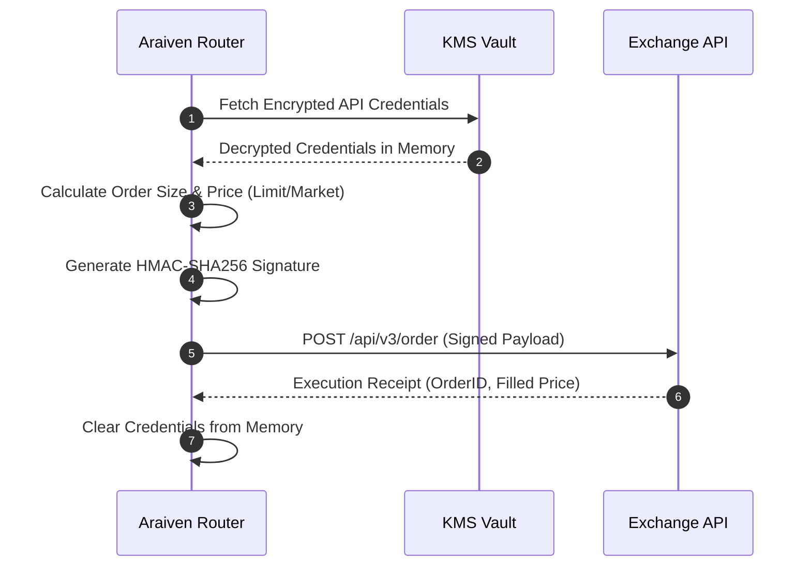

# Ravora Exchange Integration - Product Specification V1.0

This document defines Ravora's trade execution engine, exchange API security, and position management rules.

---

## 1. Ravora Trading Evolution Model

```
+------------------------------------------------------------------------------+
|                           TRADING EVOLUTION STAGES                           |
+--------------------------------------+---------------------------------------+
                                       |
    +----------------------------------+----------------------------------+
    |                                  |                                  |
+---v-----------------------+  +-------v----------------------+  +--------v-------------------+
|  STAGE 1: ADVISORY &      |  |  STAGE 2: SEMI-AUTOMATED     |  |  STAGE 3: FULLY AUTOMATED  |
|  PAPER TRADING (V1)       |  |  TRADING (V1.5)              |  |  AUTOPILOT (V2)            |
+---------------------------+  +------------------------------+  +----------------------------+
| * Virtual Portfolio       |  | * 1-Click Approval Model     |  | * Automated Rebalancing    |
| * Real-time Mock Trades   |  | * Trades execute via APIs    |  | * Hard stop-loss triggers  |
| * Zero exchange risk      |  | * Withdrawal access blocked  |  | * Continuous exposure guard|
+---------------------------+  +------------------------------+  +----------------------------+
```

### Stage 1: Advisory & Paper Trading (V1)
* **Goal:** Validate strategies and build user trust.
* **Logic:** Araiven analyzes real-time market data and wallet simulations. Swap suggestions are displayed in the dashboard. Confirming a trade executes it in the simulated paper account.

### Stage 2: Semi-Automated Trading (V1.5)
* **Goal:** Safely integrate live brokerage execution.
* **Logic:** The user connects exchange APIs (read-only + trade permissions). Araiven surfaces suggestions. If the user clicks **Approve & Execute**, Ravora places the trades directly on the exchange.

### Stage 3: Fully Automated Autopilot (V2.0)
* **Goal:** Enable hands-free wealth compounding.
* **Logic:** The user authorizes Araiven to trade within strict target allocation percentages (e.g., 40-50% ETH). Safety rebalancing swaps (e.g., rotating to stablecoins during drawdowns) execute automatically.

---

## 2. API Key Management & Security Model
Ravora is a non-custodial platform. To connect an exchange (Binance, Bybit, Coinbase, Kraken), the user must configure API credentials under the following security model:

```
+-----------------------+      Encrypt with AWS KMS      +----------------------+
|  User enters API key  | -----------------------------> | Secure Vault Store   |
|  & Secret credentials |                                | (AES-256 GCM)        |
+-----------------------+                                +----------+-----------+
                                                                    |
                                                                    | Route order payload
                                                                    v
+-----------------------+      Verify signature          +----------------------+
|  Connected Exchange   | <----------------------------- | Order Router Engine  |
|  (Withdrawal BLOCKED) |      (HMAC-SHA256 Signed)      | (IP Whitelisted IP)  |
+-----------------------+                                +----------------------+
```

1. **Permission Isolation:** API keys must have **Withdrawal Permissions Disabled** (Read-Only + Trade Execution enabled).
2. **KMS Encryption:** API secrets are encrypted using AWS Key Management Service (KMS) with AES-256 GCM before database storage. Keys are decrypted only inside memory buffers during order signing.
3. **IP Whitelisting:** Orders are routed through a fixed pool of whitelisted Ravora IP addresses. Exchange APIs will reject any orders originating from non-whitelisted IPs.

---

## 3. Order Execution Pipeline



* **Execution Types:** Araiven prioritizes **Limit Orders** to avoid slippage. If liquidity is thin and volatility is high, the engine uses **Immediate-Or-Cancel (IOC)** limit orders, falling back to Market orders only for emergency drawdown protection.
* **Slippage Protection:** Orders are rejected if the current market price deviates by more than **0.5%** from the price at which the opportunity was identified.

---

## 4. Position Sizing & Risk Controls
To protect capital, the exchange engine enforces hard limits on all orders:

1. **Maximum Allocation Cap:** No single asset allocation recommendation can exceed **30%** of total portfolio value (to prevent overexposure).
2. **Stance Sizing Multiplier:**
   * **Conservative:** Max trade size is limited to **5%** of portfolio capital.
   * **Balanced:** Max trade size is limited to **10%** of portfolio capital.
   * **Aggressive:** Max trade size is limited to **15%** of portfolio capital.
3. **Execution Rate-Limiting:** To prevent API lockouts, order execution is rate-limited to a maximum of **5 orders per minute** per user profile.

---

## 5. Stop-Loss (SL) & Take-Profit (TP) Logic
* **Dynamic Trailing Stops:** When the user approves a momentum opportunity (e.g., BTC Accumulation), Araiven automatically configures a trailing stop-loss relative to the user's risk profile:
  * *Conservative:* trailing stop set at **-2%** from entry.
  * *Balanced:* trailing stop set at **-4%** from entry.
  * *Aggressive:* trailing stop set at **-8%** from entry.
* **Profit-Taking Tiers:** Momentum opportunities are closed out in predefined increments (e.g., selling 50% of the position at Target 1, 25% at Target 2, and trailing the remainder).
