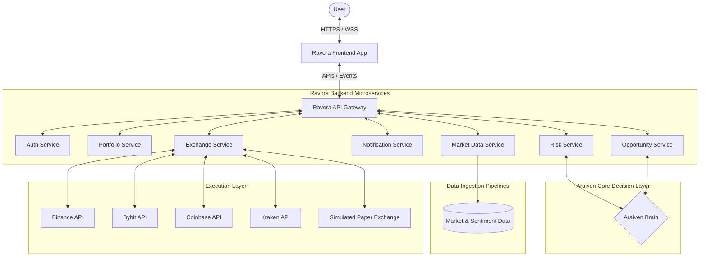

# Ravora System Architecture - Master Technical Blueprint V1.0

This document defines the complete technical architecture and system blueprint for Ravora, designed to scale to millions of users.

---

## 1. High-Level System Architecture

The diagram below outlines the end-to-end data flow and logical boundaries of the Ravora platform:



---

## 2. Frontend Architecture
The Ravora frontend is built as a lightweight, high-performance static shell optimized for fast loading and secure client-side routing.

* **Landing Page:** Static HTML utilizing vanilla CSS custom properties for theme styling and a responsive script for interactive simulations (e.g. Fed Rate volatility trigger).
* **Dashboard SPA:** A single-page application structure ([app/index.html](file:///c:/Projects/Ravora/app/index.html)) loaded from a CDN. Client-side routing resolves routes dynamically using state storage.
* **Araiven Copilot Widget:** An active WebSocket chat interface enabling real-time dialogue and directive authorizations.
* **Portfolio & Analytics Cards:** High-DPI canvas/SVG renders that dynamically map assets (ETH, BTC, USDC) using responsive chart modules.
* **Settings & Connections Panel:** Client-side credentials input form that passes raw API keys straight to encryption microservices without client logging.

---

## 3. Backend Architecture (Microservices)
The backend is structured as a collection of decoupled, stateless microservices communicating asynchronously via an event-driven broker (Apache Kafka / RabbitMQ) and synchronously via gRPC:

1. **Authentication Service:** Manages user registration, JWT session verification, and Multi-Factor Authentication (MFA).
2. **Portfolio Service:** Aggregates current holdings, computes entry bases, tracks performance milestones, and records historical clearing ledgers.
3. **Opportunity Service:** Compiles alpha opportunities, ranks strategies, and monitors yield pool dynamics.
4. **Notification Service:** Handles push token registration, emails, and in-app alerts mapped to priorities.
5. **Market Data Service:** Standardizes raw price/orderbook ingestion from multiple exchange web-sockets.
6. **Risk Service:** Evaluates correlation matrices, calculates portfolio drawdowns, and manages stop-loss bounds.
7. **Exchange Service:** Encrypts API keys, manages orders, white-lists execution IPs, and signs exchange requests.

---

## 4. Araiven Intelligence Architecture

```
                                  DATA INGESTION
                                (Kafka / Streams)
                                        |
+---------------------------------------v---------------------------------------+
|                            PROCESSING PIPELINE                                |
+---------------------------------------+---------------------------------------+
                                        |
    +-----------------------------------+-----------------------------------+
    |                                                                       |
+---v------------------------+                                      +-------v--------------------+
|   PORTFOLIO ANALYSIS       |                                      |   CORRELATION FILTERING    |
+----------------------------+                                      +----------------------------+
| Evaluates user risk limits |                                      | Models asset covariance    |
| & active goal stance.      |                                      | to hedge systemic risk.    |
+----------------------------+                                      +----------------------------+
    |                                                                       |
    +-----------------------------------+-----------------------------------+
                                        |
+---------------------------------------v---------------------------------------+
|                               DECISION LAYER                                  |
+---------------------------------------+---------------------------------------+
                                        |
                                        | Generates optimized trade allocations
                                        v
+---------------------------------------v---------------------------------------+
|                          RECOMMENDATION COMPLIANCE                            |
+---------------------------------------+---------------------------------------+
                                        |
                                        | Outputs plain-language explanation
                                        v
+---------------------------------------v---------------------------------------+
|                          DIRECTIVE PUSH (1-Click)                             |
+-------------------------------------------------------------------------------+
```

* **Data Processing Layer:** Runs NLP sentiment analysis over news feeds and calculates correlation matrices across tokens.
* **Decision Engine:** Runs the confidence scoring algorithms to filter out setups below the 75% threshold.
* **Recommendation Compiler:** Uses templates to formulate clear explanations based on the user's experience stance.

---

## 5. Unified Data Inflow
The **Market Data Service** ingests data from multiple providers to ensure redundancy:
* **Asset Prices:** Direct exchange WebSocket connections + Chainlink Oracles for decentralized yields.
* **Orderbooks:** Level 2 orderbook depth feeds tracking volume support.
* **Context/Sentiment Data:** NLP indexing of macroeconomic events and news streams.
* **User Metrics:** Read-only exchange balances synchronized hourly.

---

## 6. Exchange & Execution Layer
* **Brokerage Drivers:** Unified exchange integration driver that translates standard transaction payloads (Asset, Size, Order Type) into exchange-specific API requests (Binance, Bybit, Coinbase, Kraken).
* **Simulated Exchange Engine:** A paper trading service utilizing real-time price updates to execute mock trades, tracking virtual portfolio performance and fee drag.

---

## 7. Scalability Roadmap

```
+-------------------------------------------------------------------------------+
|                             SCALING PHASES                                    |
+--------------------------------------+----------------------------------------+
                                       |
    +----------------------------------+----------------------------------+
    |                                  |                                  |
+---v------------------------+  +------v---------------------+  +---------v------------------+
|    STARTUP (100 - 1k Users)|  |   GROWTH (10k - 100k Users)|  |    SCALE (1M+ Users)       |
+----------------------------+  +----------------------------+  +----------------------------+
| * Monolithic VPS           |  | * Decoupled Microservices  |  | * Kubernetes Orchestration |
| * Single PostgreSQL DB     |  | * Kafka Message Broker     |  | * Redis Caching Clusters   |
| * Simple Cron Polling      |  | * Redis Cache Layer        |  | * Multi-Region Database    |
+----------------------------+  +----------------------------+  +----------------------------+
```

### Phase 1: Startup (100 - 1,000 Users)
* **Stack:** Monolithic API server deployed on a single VPS (e.g. AWS EC2). Single PostgreSQL database instance.
* **Pipeline:** Cron-based market data polling. In-memory queuing for simulated trades.

### Phase 2: Growth (10,000 - 100,000 Users)
* **Stack:** Separation of API servers from background workers. Introduction of a **Redis** caching layer for market prices.
* **Pipeline:** Asynchronous event queues (RabbitMQ / Kafka) to handle trade execution and alerts. Read-replicas configured on PostgreSQL.

### Phase 3: Scale (1,000,000+ Users)
* **Stack:** Microservices deployed inside **Kubernetes (EKS)** with auto-scaling groups. Multi-region PostgreSQL databases with active replication.
* **Pipeline:** Distributed Kafka clusters handling streaming orderbooks. Redis cluster to serve real-time portfolio metrics instantly.

---

## 8. Security Architecture
* **KMS Vault Storage:** Exchange API keys are encrypted at rest using AWS KMS (AES-256 GCM). Plaintext keys are never written to disk or logs.
* **Withdrawal Blocks:** Ravora's gateway automatically rejects exchange API credentials during onboarding if withdrawal permissions are enabled.
* **Whitelisted Routing:** The exchange execution service is locked to a pool of whitelisted static IP addresses.
* **RBAC Controls:** Role-Based Access Control limits internal tool configurations (e.g. only designated risk systems can broadcast emergency rebalancing signals).

---

## 9. Future Expansion Blueprint
While V1 focuses exclusively on Crypto markets (BTC, ETH, SOL, USDC), the system is architected to integrate traditional financial markets in future releases:

```
                                 API GATEWAY
                                      |
         +----------------------------+----------------------------+
         |                                                         |
+--------v-------+                                        +--------v-------+
|  CRYPTO BRIDGE |                                        | TRADITIONAL FI |
|                |                                        |     BRIDGE     |
| Binance, Bybit |                                        | Plaid, Alpaca  |
+----------------+                                        +--------+-------+
                                                                   |
                                          +------------------------+------------------------+
                                          |                        |                        |
                                 +--------v-------+       +--------v-------+       +--------v-------+
                                 |  STOCKS / ETFs |       |    FOREX       |       |  COMMODITIES   |
                                 |                |       |                |       |                |
                                 | Equities index |       | FX liquidity   |       | Precious       |
                                 | allocations    |       | spot pairs     |       | metals indices |
                                 +----------------+       +----------------+       +----------------+
```

* **Asset Adapters:** The portfolio and market services use an abstract asset interface, allowing them to support Stocks, ETFs, Forex, and Commodities by connecting to traditional broker APIs (like Alpaca or Interactive Brokers).
* **Multi-Tenant Architecture:** Supports institutional features like multi-user organization controls and corporate wealth custody managers.
