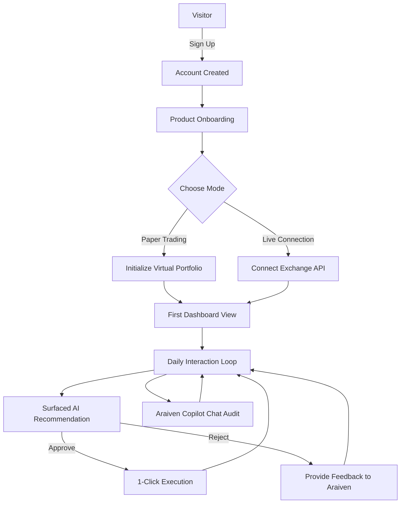
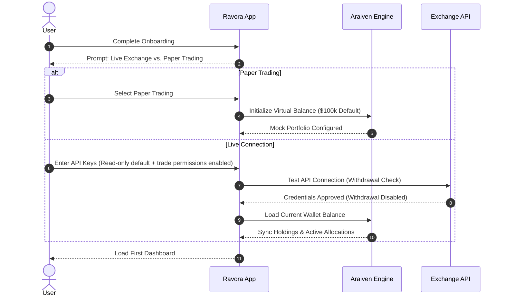
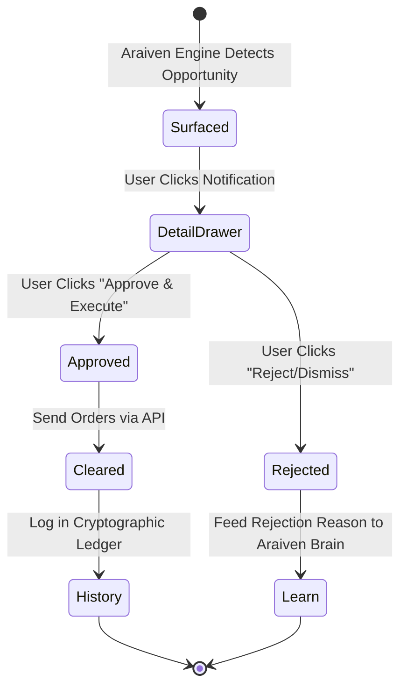

# Ravora User Flow - Product Specification V1.0

This document defines the complete user journey and platform flows for Ravora, serving as the product source of truth.

---

## 1. Complete User Journey Map

---

## 2. Step-by-Step Flow Specifications

### 2.1 Post-Signup & Onboarding
Immediately after registration, the user enters the **Product Onboarding Wizard** inside the web app. This wizard collects critical profiling parameters to initialize the Araiven Engine instance:

1. **Step 1: Experience Profiling**
   * *Options:* Beginner, Active Investor, Professional.
   * *Impact:* Determines the complexity of terminology in AI recommendations, explanations, and copilot dialogue.
2. **Step 2: Capital Allocation Setup**
   * *Options:* A slider from $5,000 to $500,000+.
   * *Impact:* Establishes the virtual/real portfolio baseline weightings and scales exposure thresholds.
3. **Step 3: Drawdown Tolerance (Risk Model)**
   * *Options:*
     * **Conservative:** Max 24h drawdown target: **1.5%**. Focuses on stablecoin lending and low-yield arbitrage.
     * **Balanced Shield:** Max 24h drawdown target: **3.5%**. Balanced exposure to L1 blue-chips and stable lending.
     * **Aggressive Swing:** Max 24h drawdown target: **8.5%**. Capture high-velocity momentum and liquidity staking.
   * *Impact:* Programs the hard stop-loss buffers and rebalancing safety triggers.
4. **Step 4: Financial Goal Stance**
   * *Options:* Capital Preservation, Steady Staking Income, Maximum Compound Growth.
   * *Impact:* Aligns Araiven’s opportunity ranking weights with user outcomes.

---

### 2.2 Account Activation (Paper vs. Live)

---

### 2.3 The First Dashboard Experience
When a user finishes onboarding and logs in for the first time, they see a clean state:
* **Araiven Ingest Sequence:** A 2-second visual loading sequence showing Araiven scanning orderbooks and establishing safety bounds.
* **Initial Directive:** A default system notification welcoming the user and establishing the active risk guard stance.
* **Balanced Portfolio View:** In Paper mode, the default $100k balance is allocated across the selected risk-profile weights (e.g., 45% ETH Staking, 30% Stablecoin Yield, 20% BTC, 5% Cash).

---

### 2.4 The Daily Active Loop
Ravora is designed to eliminate active screen-watching. The daily user experience revolves around:

1. **Daily Market Digest:** A quick, plain-English summary of market events analyzed by Araiven, showing how they affect the user's active goals.
2. **Directive Alerts:** Pop-ups or notifications when Araiven detects a high-probability opportunity matching the user's risk profile.
3. **Conversational Strategy Auditing:** Users can open the **Araiven Copilot** chat panel at any time to ask:
   * *"Why did we rebalance into stablecoins yesterday?"*
   * *"What is my current safety score?"*
   * *"Evaluate our current exposure to Ethereum volatility."*

---

### 2.5 Recommendation Execution Loop

#### One-Click Approval Flow
1. **Surfacing:** Araiven detects an opportunity (e.g., ETH Staking yield premium) and pushes it to the dashboard.
2. **Reviewing:** The user opens the **Opportunity Detail Drawer** to inspect:
   * Confidence score (e.g., 94%)
   * Risk parameter details
   * Allocation percentage adjustment (e.g., Swap 8% USDC for ETH)
   * Detailed text reasoning explaining the underlying market metrics.
   * The user clicks **Confirm & Deploy**. The platform routes the swap orders to the connected exchange or executes them in the simulated paper account. 

---

### 2.6 Evolution: Full Autopilot Mode
While V1 enforces a **1-Click Execution** model to build user trust, the system architecture supports future autopilot options:
* **Manual Approval (Default V1):** Araiven recommends; user must approve each swap.
* **Autopilot Guard (V1.5):** User authorizes autopilot for protective hedging only (e.g., auto-reallocate to USD stables during drawdown spikes, but require manual confirmation to re-enter risk positions).
* **Full Autopilot (V2.0):** Autonomous allocation changes within strict target allocation bands and risk rules.
